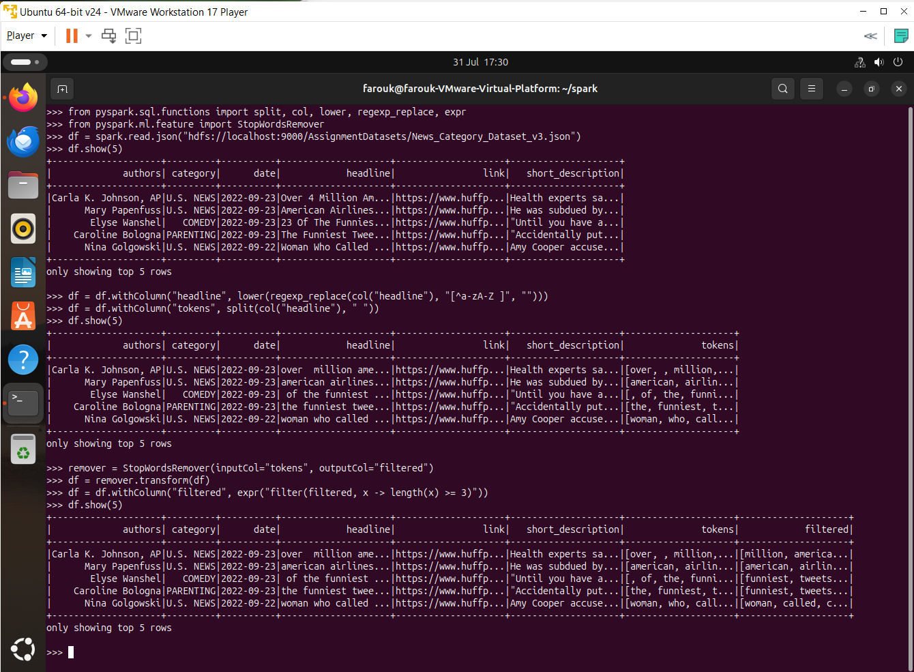
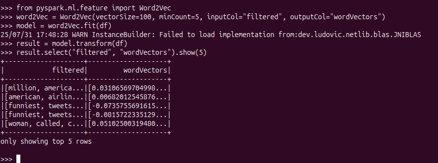
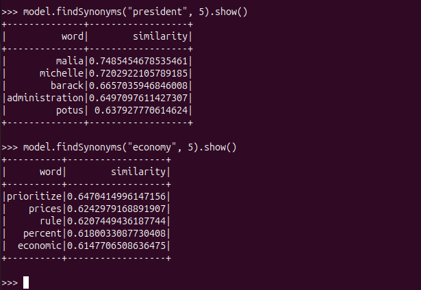
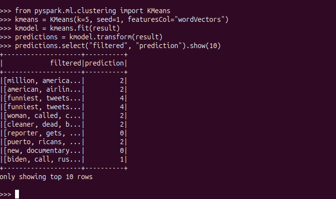

# Word2Vec Embeddings and Topic Clustering on a  News Dataset

This repository contains part of my MSc *Machine Learning on Big Data* coursework (at University of East London).  
The aim is to demonstrate how distributed word embeddings and clustering can be implemented on a large news dataset using PySpark and then extended to a real‑time streaming use case.

The work is split into two main parts:

1. **Batch learning** – Train a Word2Vec model on a large news headline corpus, then use K‑Means to discover latent topic clusters.
2. **Streaming topic assignment** – Reuse the trained Word2Vec + K‑Means models inside Spark Structured Streaming to assign topic clusters to incoming, real‑time news headlines.

This project was originally developed and run on a Hadoop + Spark environment as part of my assessment on *Machine Learning on Big Data*.

---
> ⚠️ **Note on academic integrity:**  
> This repository is a *restructured, summarised* version of work originally completed as part of a university assignment. It is shared here purely as a portfolio of practical skills in *Machine Learning on Big Data*. Anyone using this material for their own coursework should adapt, extend, and properly acknowledge it rather than copying directly.
---

## Objectives

- Build **distributed word embeddings** (Word2Vec) over a large collection of news headlines.
- Use **K‑Means clustering** to group semantically similar headlines into topics.
- Persist trained models and reuse them in a **structured streaming pipeline**.
- Demonstrate how offline (batch) learning can be integrated into **real‑time analytics** on large‑scale text data.

---

## Dataset

- **News Category Dataset** (Rishabh, 2022) – JSON file with ~200k news headlines and their category labels.
 [Available at: https://www.kaggle.com/datasets/rmisra/news-category-dataset]
- In the original coursework this was stored on HDFS, e.g.  
  `hdfs://localhost:9000/AssignmentDatasets/News_Category_Dataset_v3.json`

Because the dataset is quite large and subject to licence terms, it is **not included** in this repository.  
Please download it separately (e.g. from the original Kaggle source) and adjust the path in the code if needed.

---

## Tech Stack

- Python 3.x
- Apache Spark / PySpark (MLlib + Structured Streaming)
- (Optional) Hadoop HDFS for distributed storage
- Linux / macOS / WSL (tested originally on Ubuntu inside a VM)

---

## Repository Structure

```text
word2vec-streaming-topic-clustering/
├── README.md
├── requirements.txt
├── .gitignore
└── src/
    ├── train_word2vec_kmeans.py
    └── streaming_topic_clustering.py
```

- `train_word2vec_kmeans.py` – batch pipeline: load data, preprocess, train Word2Vec + K‑Means, save models.
- `streaming_topic_clustering.py` – streaming pipeline: load saved models and assign topic clusters to incoming headlines.

---

## Getting Started

### 1. Create / activate environment

```bash
python -m venv .venv
source .venv/bin/activate        # On Windows: .venv\Scripts\activate
pip install -r requirements.txt
```

You will also need a working **Spark** installation. On a single machine you can run Spark in *local* mode; in a bigger setup you can use a Spark cluster with HDFS.

### 2. Configure paths

Edit the file paths at the top of `src/train_word2vec_kmeans.py` and `src/streaming_topic_clustering.py`:

- `NEWS_DATA_PATH` – path to the news JSON file (HDFS or local).
- `WORD2VEC_MODEL_PATH`, `KMEANS_MODEL_PATH` – where to save / load trained models.
- `STREAM_INPUT_DIR` – directory to watch for incoming streaming text files.

### 3. Train Word2Vec + K‑Means

```bash
spark-submit src/train_word2vec_kmeans.py
```

This will:

1. Read the news dataset.
2. Clean and tokenise the headlines.
3. Train a Word2Vec model.
4. Train a K‑Means model on the resulting embeddings.
5. Save both models to disk (or HDFS).

### 4. Run Streaming Topic Clustering

In one terminal, start the streaming job:

```bash
spark-submit src/streaming_topic_clustering.py
```

In another terminal, simulate new “incoming” headlines by appending small text files into the configured streaming input directory, for example:

```bash
echo "Breaking: markets rally after central bank announcement" > /path/to/stream_input/news1.txt
echo "Elections: turnout higher than expected in key states"   > /path/to/stream_input/news2.txt
```

The streaming job will print each incoming line together with its **predicted cluster id**, which can be interpreted as a coarse topic label.

---
## Example Screenshots

These are some screenshots from my original coursework showing the outputs I received throughout my work.

1. **Dataset Pre-processing Steps**
    
    *Output showing successful completion of dataset pre-processing steps*

2. **Training the Model**
    
    *Output showing model training completed successfully*

3. **Finding Closest Words** (Nearest Neighbour Analysis)
    
    *Top 5 closest words to " president" and "economy"*

4. **Clustering Word Vectors** (using K-Means)
    
    *Clustering Output Sample*

5. **Visualisation** (using PCA in Python)
    
    *2D plot of word vectors using PCA*
---

## Notes

- The focus of this repository is to demonstrate **how to use PySpark on large‑scale text data**, rather than to achieve state‑of‑the‑art topic modelling.
- Hyperparameters (embedding size, number of clusters, etc.) are kept simple so they are easy to understand and tune.
- The code is structured to reflect how I approached the original **coursework**: separating environment setup, batch model training, and streaming analytics into clear steps.
